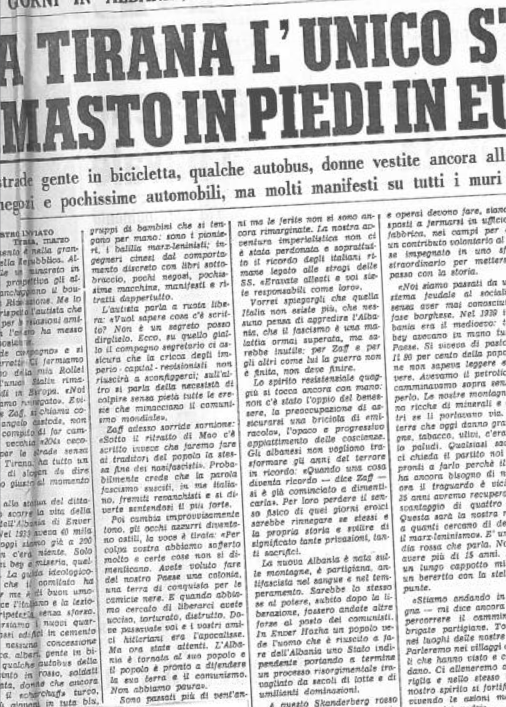

## Tirana, 5 marzo 1967

II monumento è nella grande piazza della Repubblica. Alle sue spalle un minareto in disuso e in prospettiva gli alberi che fiancheggiano il boulevard della Rivoluzione. Me lo indica con rispetto l’autista che il comitato per le relazioni amichevoli con l’estero ha messo a mia disposizione.

«Il grande compagno» e si tocca la berretta .Ci fermiamo e l’obiettivo della mia Rollei inquadra l’unico Stalin rimasto in piedi in Europa. «Noi non l’abbiamo rinnegato». Evidentemente Zaff, si chiama cosi il mio angelo custode, non ha solo il compito di far camminare la vecchia «204» cecoslovacca per le strade senza traffico di Tirana: ha tutto un repertorio di slogan da dire con il tono giusto al momento giusto.

Davanti alla statua del dittatore russo scorre la vita della capitale dell’Albania di Enver Hoxha. «Nel 1933 aveva 40 mila abitanti, oggi siamo già a 200 mila. Non c’era niente. Solo le ville dei bey e miseria, quella tanta». La guida ideologico-turistica che il comitato ha scelto per me è di buon umore: conosce l’italiano e la lezione può ripeterla senza sforzo.

Attraversiamo i nuovi quartieri. Grossi edifici in cemento armato, nessuna concessione all’estetica, alberi, gente in bicicletta, qualche autobus della Fiat dipinto in rosso, soldati dell’armata, donne che ancora portano il «charchaff» turco, altre più giovani in tuta blu, gruppi di bambini che si tengono per mano: sono i pionieri, i balilla marx-leninisti; ingegneri cinesi dal comportamento discreto con libri sottobraccio, pochi negozi, pochissime macchine, manifesti e ritratti dappertutto.

L’autista parla a ruota libera: «Vuol sapere cosa c’è scritto? Non è un segreto posso dirglielo. Ecco, su quello giallo il compagno segretario ci assicura che la cricca degli imperio-capital-revisionisti non riuscirà a sconfiggerci; sull’altro si parla della necessità di colpire senza pietà tutte le eresie che minacciano il comunismo mondiale». Zaff adesso sorride sornione: «Sotto il ritratto di Mao c’è scritto invece che faremo fare ai traditori del popolo la stessa fine dei nazifascisti». Probabilmente crede che la parola fascismo susciti, in me italiano, fremiti revanchisti e si diverte sentendosi il più forte. Poi cambia improvvisamente tono, gli occhi azzurri diventano ostili, la voce è tirata: «Per colpa vostra abbiamo sofferto molto e certe cose non si dimenticano. Avete voluto fare del nostro Paese una colonia, una terra di conquista per le camicie nere. E quando abbiamo cercato di liberarci avete ucciso, torturato, distrutto. Dove passavate voi e i vostri amici hitleriani era l’apocalisse. Ma ora state attenti. L’Albania è tornata al suo popolo e il popolo è pronto a difendere la sua terra e il comunismo. Non abbiamo paura».

Sono passati più di vent’anni ma le ferite non si sono ancora rimarginate. La nostra avventura imperialistica non ci è stata perdonata e soprattutto il ricordo degli italiani rimane legato alle stragi delle SS. «Eravate alleati e voi siete responsabili come loro».

Vorrei spiegargli che quella Italia non esiste più, che nessuno pensa di
aggredire l’Albania, che il fascismo è una malattia ormai superata, ma sarebbe inutile: per Zaff e per gli altri come lui la guerra non è finita, non deve finire.

Lo spirito resistenziale quaggiù si tocca ancora con mano: non c’è stato l’oppio del benessere, la preoccupazione di assicurarsi una briciola di «miracolo», l’opaco e progressivo appiattimento delle coscienze. Gli albanesi non vogliono trasformare gli anni del terrore in ricordo: «Quando una cosa diventa ricordo − dice Zaff − si è già cominciato a dimenticarla». Per loro perdere il senso fisico di quei giorni eroici sarebbe rinnegare se stessi e la propria storia e svilire di significato tante privazioni, tanti sacrifici.

La nuova Albania è nata sulle montagne, è partigiana, antifascista nel sangue e nel temperamento. Sarebbe lo stesso se al potere, subito dopo la liberazione, fossero andate altre forze al posto dei comunisti. In Enver Hoxha un popolo vede l’uomo che è riuscito a fare dell’Albania uno Stato indipendente portando a termine un processo risorgimentale travagliato da secoli di lotte e di umilianti dominazioni. A questo Skanderberg rosso gli skipetari credono come in un Messia: fu lui a vendicarli delle inaudite ferocie perpetrate dai nazisti (in percentuale l’Albania ha avuto nell’ultima guerra un numero di morti tre volte superiore a quello della Inghilterra) e a riscattarli dalla barbarie economica e sociale alla quale erano stati per secoli condannati dai bey dalla lunga scimitarra e dai feudi sconfinati. Per questo la parola «partizan» nella roccaforte europea del marx-leninismo non è stata messa in naftalina, e per questo la guerra, secondo loro, deve continuare.

Sulla piazza Lenini incontriamo una lunga colonna di camion. Sono gli studenti che vanno a conquistare nuove terre all’agricoltura: volontari, guardie rosse, membri della gioventù del lavoro. Resteranno lontano dalla città un mese poi torneranno a scuola e saranno sostituiti da altri compagni. A loro spetta il compito di portare avanti la bonifica rurale e quella ideologica.

«Come i vostri picconi e le vostre zappe trasformeranno la pietra in alberi così la vostra cultura dovrà sradicare tutto quello che rimane del passato e far scomparire per sempre i cattivi costumi». È il primo comandamento della rivoluzione culturale. I cattivi costumi sono tante cose: la religione, l’egoismo, l’insofferenza al sacrificio, lo spirito affaristico, la tendenza revisionista, il pacifismo sospetto, la stanchezza fisica, l’ostentato interesse per i piaceri materiali. Il regime è duro. Ha bisogno di due milioni di uomini che finite le otto ore di lavoro giornaliere che tutti, intellettuali e operai devono fare, siano disposti a fermarsi in ufficio, in fabbrica, nei campi per dare un contributo volontario al Paese impegnato in uno sforzo straordinario per mettersi al passo con la storia.

«Noi siamo passati da un sistema feudale al socialismo, senza aver mai conosciuto la fase borghese. Nel 1939 in Albania era il medioevo: trenta bey avevano in mano tutto il Paese. Si viveva di pastorizia. Il 90 per cento della popolazione non sapeva leggere e scrivere. Avevamo il petrolio e ci camminavamo sopra senza saperlo. Le nostre montagne erano ricche di minerali e gli altri se li portavano via. Nelle terre che oggi danno grano, vigne, tabacco, ulivi, c’erano solo paludi. Qualsiasi sacrificio ci chieda il partito noi siamo pronti a farlo perchè il Paese ha ancora bisogno di noi. Ma ora il traguardo è vicino: in 25 anni avremo recuperato uno svantaggio di quattro secoli. Questa sarà la nostra risposta a quanti cercano di denigrare il marx-leninismo». È una guardia rossa che parla. Non deve avere più di 15 anni. Indossa un lungo cappotto militare e un berretto
con la stella a sei punte.

«Stiamo andando in montagna − mi dice ancora − a ripercorrere il cammino delle brigate partigiane. Torneremo nei luoghi delle nostre vittorie. Parleremo nei villaggi con quelli che hanno visto e che ricordano. Ci alleneremo alla guerriglia e nello stesso tempo il nostro spirito si fortificherà rivivendo le azioni memorabili dei nostri padri».

Il tono del mio nuovo Interlocutore è enfatico ma convinto. È stato Zaff a chiamarlo. Sicuramente è uno che gode la fiducia del comitato. Gli chiedo se ritiene possibile che arrivi un giorno in cui non sarà più necessario portare una arma a tracolla.

«Vuol dire il dialogo? La distensione? L’atteggiamento dei traditori revisionisti?». Ha una faccia seria da vecchio precoce. Scuote la testa e in un francese dalle «s» dure: «Mi dica: c’è stato mai un discorso sereno tra il lupo e l’agnello?». È soddisfatto, crede di avermi messo alle corde. Saluta Zaff con il pugno chiuso e me con un cenno del capo. Passa il mitra dalla spalla sinistra alla spalla destra e corre a raggiungere un gruppo di miliziane che lo aspetta davanti al palazzo della cultura.

Il quesito-apologo non manca di rigore logico: resta da sapere solamente chi è il lupo.

