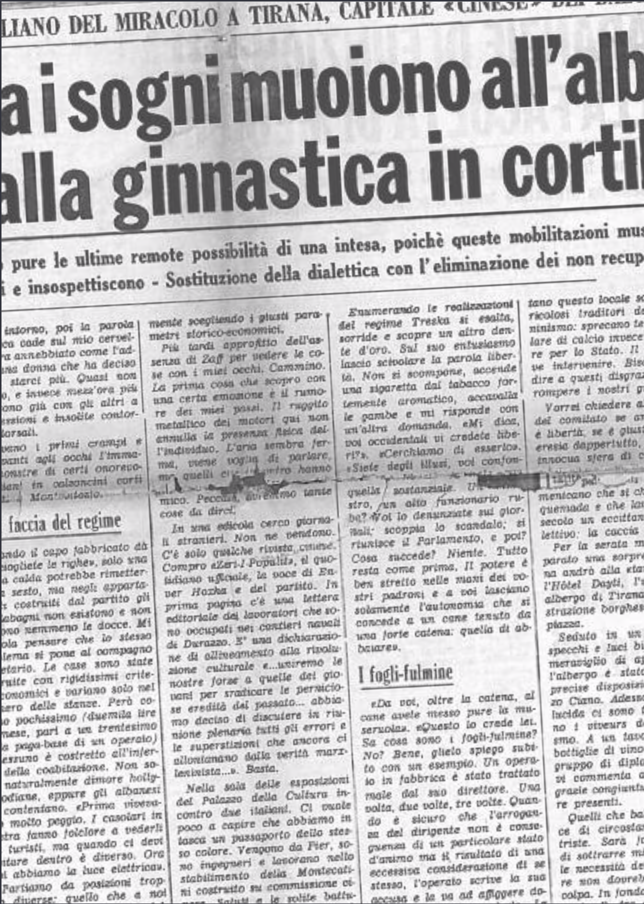

## Tirana, 7 marzo 1967

Prendete un occidentale tipo integrato alla civiltà dei consumi, uno che si copre di cambiali per conquistare il nirvana elettro-transistorizzato del comfort, svegliatelo alle sei di mattina e portatelo in cortile a fare mezz’ora di esercizi a corpo libero con un freddo che ti ghiaccia in bocca pure le maledizioni, e poi andategli a parlare di Marx-Leninismo. In Albania, insieme ai sogni, muoiono all’alba pure le ultime remote possibilità di una intesa. Siamo due mondi: non c’è niente da fare. Sul piano dell’ideologia pura un punto d’incontro forse si può anche cercare di scovarlo, ma con il dogma della ginnastica coatta non ci siamo proprio. I nostri velleitarismi di rivoluzionari da cine-club non reggono alla verifica dell’uno-due-tre ordinato dal capo fabbricato. «Decadenza fisica e morale» dicono loro, ma sbagliano. Le giunture arrugginite non c’entrano. Il fatto è che queste «mobilitazioni» muscolari insospettiscono e ripropongono immagini di ieri.
Poi il senso del ridicolo. Riuscire a vedere nella vicina di fila, paonazza per lo sforzo di riportare in equilibrio un seno prosperoso e sfiorito di cinquantenne, la inarrestabile marcia del proletariato è veramente difficile. Ci ho provato comunque, e ora vi racconterò la giornata di un italiano del miracolo a Tirana, capitale «cinese» dei Balcani, nel marzo 1967, anno primo della rivoluzione culturale.
Alle sei tutti in piedi. L’uomo che mi ospita è imbarazzato. Non sa come spiegarmi la ragione dell’alzataccia. Ci gira un po’ intorno, poi la parola ginnastica cade sul mio cervello ancora annebbiato come l’addio di una donna che ha deciso di non starci più. Quasi non ci credo, e invece mezz’ora più tardi sono giù con gli altri a fare flessioni e insolite contorsioni dorsali.
Arrivano i primi crampi e ho davanti agli occhi l’Immagine-monstre di certi onorevoli italiani in calzoncini corti davanti a Montecitorio.

### Dura faccia del regime

Quando il capo fabbricato dà lo «sciogliete le righe», solo una doccia calda potrebbe rimettermi in sesto, ma negli appartamenti costruiti dal partito gli scaldabagni non esistono e non esistono nemmeno le docce. Mi consola pensare che lo stesso problema si pone al compagno segretario. Le case sono state costruite con rigidissimi criteri economici e variano solo nel numero delle stanze. Però costano pochissimo (duemila lire al mese, pari a un trentesimo della paga-base di un operaio) e nessuno è costretto all’inferno della coabitazione. Non sono naturalmente dimore hollywoodiane, eppure gli albanesi si contentano. «Prima vivevamo molto peggio. I casolari in pietra fanno folclore a vederli da turisti, ma quando ci devi abitare dentro è diverso.
Ora poi abbiamo la luce elettrica».
Partiamo da posizioni troppo diverse: quello che a noi sembra la conferma
di un fallimento è per loro la testimonianza di un progresso, e la ragione sta da tutte e due le parti. Un esame comparato è impossibile. Sono due realtà che vanno analizzate separatamente scegliendo i giusti parametri storico-economici.
Più tardi approfitto dell’assenza di Zaff per vedere le cose con i miei occhi. Cammino. La prima cosa che scopro con una certa emozione è il rumore dei miei passi. Il ruggito metallico dei motori qui non annulla la presenza fisica dell’individuo. L’aria sembra ferma, viene voglia di parlare, ma quelli che incontro (... testo mancante nell’originale). Peccato, avremmo tante cose da dirci. In una edicola cerco giornali stranieri. Non ne vendono. C’è solo qualche rivista cinese. Compro «Zeri-I-Popùlit», il quotidiano ufficiale, la voce di Enver Hoxha e del partito. In prima pagina c’è una lettera editoriale dei lavoratori che sono occupati nei cantieri navali di Durazzo. È una dichiarazione di allineamento alla rivoluzione culturale «... uniremo le nostre forze a quelle dei giovani per sradicare le perniciose eredità del passato... abbiamo deciso di discutere in riunione plenaria tutti gli errori e le superstizioni che ancora ci allontanano dalla verità marx- leninista...». Basta.
Nella sala delle esposizioni del Palazzo della Cultura incontro due italiani. Ci vuole poco a capire che abbiamo in tasca un passaporto dello stesso colore. Vengono da Pier, sono ingegneri e lavorano nello stabilimento della Montecatini costruito su commissione cinese. Saluti e le solite battute sulle donne. Dopo aver ascoltato lamentele sulla componente «siciliana» delle miliziane skipetane («ma quale amore libero! Cercano marito») vengo a sapere che qualche giorno prima le guardie rosse hanno smantellato una chiesa cattolica. I tre preti che per anni avevano resistito alle intimidazioni del regime sono stati inviati in una comune agricola. «Hanno incendiato gli arredi sacri e hanno detto che la chiesa sarà trasformata in un istituto tecnico. Non hanno pietà per nessuno. Sa come si sono giustificati? Affermando che in un Paese dove tutti lavorano è immorale che esistano dei professionisti delle preghiere. Persino il vostro Dio − aggiungono − comandò di guadagnare il pane con il sudore della fronte. Ha capito? Roba da matti. Una vecchia credente che aveva cercato di salvare una immagine della Madonna ha passato guai seri. Anche
con il figlio se la sono presa: ha perso il posto in fabbrica e l’hanno mandato chissà dove. Di lui non si hanno più notizie». È l’altra faccia del regime, quella dura: non c’è tempo per i discorsi. Alla persuasione si sostituisce l’ordine perentorio, alla dialettica democratica delle opposizioni la sistematica eliminazione. dei non «recuperabili». Alle ore dodici lezione di ideologia al comitato. È Mistro Treska, il presidente, a ricevermi. Rassomiglia a Carlo Ponti
e ha due denti d’oro: una debolezza da capitalista che potrebbe costargli una censura. Parla degli enormi progressi fatti dall’Albania sulla strada della industrializzazione: «Tra qualche anno avremo raggiunto l’autosufficienza economica. Il Paese è ricco di materie prime e noi albanesi siamo pochi, nemmeno due milioni».
Enumerando le realizzazioni del regime Treska si esalta, sorride e scopre un altro dente d’oro. Sul suo entusiasmo lascio scivolare la parola libertà. Non si scompone, accende una sigaretta dal tabacco fortemente aromatico, accavalla le gambe e mi risponde con un’altra domanda. «Mi dica, voi occidentali vi credete liberi?». «Cerchiamo di esserlo». «Siete degli illusi, voi confondete (... testo mancante nell’originale) un alto funzionario ruba.? Voi lo denunziate sui giornali; scoppia lo scandalo; si riunisce il Parlamento, e poi? Cosa succede? Niente. Tutto resta come prima. Il potere è ben stretto nelle mani dei vostri padroni e a voi lasciano solamente l’autonomia che si concede a un cane tenuto da una forte catena: quella di abbaiare».

### I fogli-fulmine

«Da voi, oltre la catena, al cane avete messo pure la museruola». «Questo lo crede lei. Sa cosa sono i fogli-fulmine? No? Bene, glielo spiego subito con un esempio. Un operaio in fabbrica è stato trattato male dal suo direttore. Una volta, due volte, tre volte. Quando è sicuro che l’arroganza del dirigente non è conseguenza di un particolare stato d’animo ma il risultato di una eccessiva considerazione di se stesso, l’operaio scrive la sua accusa e la va ad affiggere dove tutti possano vederla. La mattina dopo si discute pubblicamente. Se gli altri lavoratori ritengono valide le critiche contenute nel documento murale viene informato il partito che prende immediati provvedimenti».

«Che tipo di provvedimenti?». «Non ci speri: non ammazziamo nessuno. In un caso come quello ipotizzato il direttore viene trasferito in una comune agricola. Faticherà per qualche mese sulla terra e perderà la sua superbia classista. D’altra parte non è una punizione troppo severa. In Albania tutti un 118
mese all’anno devono fare lavoro manuale. Anche il compagno Hoxha e gli altri che hanno la responsabilità di governarci. Anzi soprattutto loro. Perché vede bisogna viverla la vita delle masse per comprenderne i problemi e le necessità e poi per un fatto di eguaglianza: non possiamo ammettere gerarchie tra intellettuali, operai e contadini. Tornando alla libertà le voglio raccontare un fatto che in Occidente saranno in molti a non credere ma che è accaduto pochi giorni fa qui a Tirano. Un ministro è stato accusato da un cittadino di usare una macchina del governo per i suoi affari personali. Il partito ha svolto delle indagini e ha scoperto che spesso il ministro in questione si faceva lunghe passeggiate in auto per andare a trovare suo figlio a spese dello Stato. Si è deciso subito di privarlo della macchina ed ora va a piedi. Per noi questa è libertà e soprattutto è giustizia.
Un’ora più tardi davanti al Bar Crimea ripenso al discorso di Ministro Treska. C’è un foglio-fulmine. In caratteri rossi un certo Ali Madhi ha scritto: «Gli sportivi che frequentano questo locale sono dei pericolosi traditori del marx-le- ninismo: sprecano tempo a parlare di calcio invece di produrre per lo Stato. Il partito deve intervenire. Bisogna impedire a questi disgraziati di corrompere i nostri giovani».
Vorrei chiedere al presidente del comitato se anche questa è libertà, se è giusto vedere la eresia dappertutto, pure in una innocua sfera di cuoio. Chissà se il (... testo mancante nell’originale) ha mai sentito parlare di un fratello domenicano che si chiamava Torquemada e che lanciò nel XVI secolo un eccittante gioco collettivo: la caccia alle streghe. Per la serata mi hanno preparato una sorpresa: dopo cena andrò alla «tavernetta» dell’Hotel Dayti, l’unico grande albergo di Tirana e la sola distrazione borghese che offra la piazza.
Seduto in un salone tutto specchi e luci bianche non mi meraviglio di apprendere che l’albergo è stato costruito su precise disposizioni di Galeazzo Ciano. Adesso sulla pedana lucida ci sono tre coppie. Sono i viveurs del marx- leninismo. A un tavolo affollato di bottiglie di vino della costa un gruppo di diplomatici jugoslavi commenta ad alta voce le grazie congiunturali delle signore presenti. Quelli che ballano hanno facce di circostanza tendenti al triste. Sarà forse il rimorso di sottrarre minuti preziosi alle necessità del partito? Eppure non dovrebbero sentirsi in colpa. In fondo il partito è presente, lì, tra gli stucchi dorati, nei capelli pieni di brillantina del tenorino stile anni ‘40, negli appassionati «a solo» del violino, nello sguardo preoccupato del batterista che sa di avere sotto le mani uno strumento che è meglio usare con discrezione perchè fa troppo Stati Uniti. Anche i componenti del complessino sono impiegati dello Stato.
Uno dei ballerini tenta l’approccio e stringendo la sua partner le alza la giacca del tailleur di foggia militare. Interpretano lo slow con un ritmo strambo da tarantella al rallentatore. La donna è robusta, nemmeno un sospetto di trucco, senza dubbio una eccellente figlia della nuova Albania, ma assolutamente priva di sexy.
Pago senza lasciare la mancia, sarebbe un’offesa gravissima. Fuori c’è il gelo e naturalmente neppure l’ombra di un taxi. In marcia. Il vento che viene dalla montagna sputa fiocchi di neve sul Palazzo del Governo, sugli anonimi edifici dove dormono i tecnici cinesi, sui cartelloni che inneggiano alla rivoluzione, sui fogli-fulmine delle guardie rosse, sugli alberi che furono piantati da qualche contadino di Lercara Friddi trasformato in legionario.
In giro non c’è nessuno, nemmeno la polizia. Piazza della Repubblica senza
le luci del Palazzo della Cultura sembra deserta. Ora il vento ha anche una voce forte. L’esile struttura del minareto rabbrividisce. Anche la Luna ha freddo. Solo il viso del dittatore georgiano resta imperturbabile: nel suo bronzo sempre tirato a lucido il compagno Stalin continua a sorridere.

