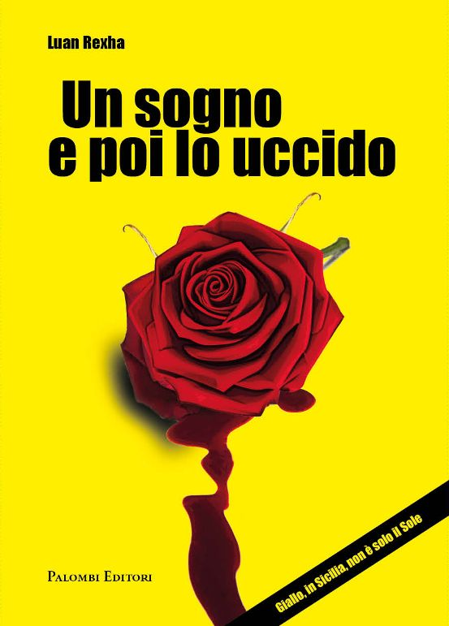

## Tirana, 7 marzo 1967

Quel figlio di troia continuava a lampeggiare rimbalzando in modo accanito sulla lastra di marmo del comodino che ospitava un lume da lettura e la mia Beretta di ordinanza.

Prima di rispondere guardai l’ora. Erano le quattro passate. Naturalmente di notte, come da copione in quel cazzo di mestiere che mi ero scelto.

“Scusame Nino, ma c’è il capo che te deve parla’ subito. È ’na cosa grossa, dicono quelli della Mobile. Resta in linea che te lo passo. Se vedemo a Roma.”

Mi avevano beccato. Addio vacanze e pausa di riflessione.

“Agli ordini signor questore. Finisco di aprire il secondo occhio e sono pronto a scattare.”

“Mi compiaccio del suo inconsueto buonumore che io purtroppo non posso condividere, tra pochi minuti sarà da lei il capo commissario di Noto. È un mio caro amico. Si metta a sua totale disposizione. Non è una preghiera è un ordine. Tanto per farle capire hanno ammazzato Angela Flower, una che ha già vinto due Oscar. E indovini dove? In una suite della masseria di lusso che ha scelto per riposarsi, a pochi metri da dove lei sta dormendo. Quando si dice la sfiga...”

Rapida occhiata allo specchio, bevi meno Nino. Pantaloni corti da ranger sudafricano, t-shirt evidenzia muscoli, ancora passabili, e in pochi minuti sono pronto per questa nuova e imprevista rottura di coglioni.
Apro la porta della stanza e mi trovo davanti il mio vecchio compagno di corso Manfredi Calaciura, un grosso cervello nascosto dietro una faccia saracena affilata e olivastra.

“Mi pigliasse un colpo. Sei tu il mio nuovo boss. Lo sapevo che avresti fatto carriera. Come lo lecchi tu ce ne sono pochi.”

Manfredi mi risponde con un sorriso e mi abbraccia. Contraccambio con affetto. Mi era sempre stato simpatico quel concentrato siculo di scaltrezza con improvvise cadute di infantile ingenuità.

Concluso il “vasavasa” cominciamo a lavorare. Il grande cortile rettangolare, cuore della masseria “Il Roseto”, era scarsamente illuminato e Manfredi ordina a due agenti che lo hanno seguito di fare entrare le auto della scorta nell’antica dimora per utilizzare i fari come supporto in attesa dell’alba.

A darci le prime informazioni su quello che è successo è una guardia giurata assunta per la stagione estiva dal padrone dell’agriturismo.

“È stata la segretaria della signora americana a scoprire il delitto. Ogni notte, alle due precise, le deve controllare la pressione arteriosa. Ma questa volta −ci fa notare con discutibile ironia − non ce n’è stato bisogno. La star era stata strangolata con un foulard di Hermes sul quale l’assassino aveva poggiato, puntata in direzione del cuore, una rosa rossa.”

La guardia giurata continua poi a deliziarci con un dettagliato resoconto del suo efficiente operato dal momento che aveva constatato il decesso fino all’arrivo della polizia. Tutta fuffa. Era chiaro solo che se la stava facendo sotto. Del resto si può capire. Sei pagato per sorvegliare e ti fanno fuori sotto il naso una delle più strafiche stelle di Hollywood. A ciascuno il suo.

Dopo tre anni era il mio secondo giorno di ferie. Manfredi mi dà un colpo sulla spalla. “Sveglia, andiamo a vedere il cadavere.”

Di corpi, privati della vita con violenze di vario tipo, ne ho visti tanti, forse troppi. Ma questo è molto diverso. Angela è stesa di traverso sul grande letto matrimoniale. Nuda, completamente nuda, salvo quel nodo di seta colorata che le serra la gola. La sto fissando con una intensità che non riesco a spiegarmi.

“Che hai?” mi fa Manfredi.

“È bellissima. Sembra che dorma. Se lo becco, sto pezzo di merda che l’ha uccisa, ti giuro che lo massacro.”

“Calmati Nino. È arrivato il medico legale. Vieni. Qui, adesso spetta alla scientifica.”

Sto seguendo il mio amico che officia con disinvolta perizia il rito delle prime indagini. Ma partecipo di sbieco. Con la testa sono rimasto nella stanza da letto e continuo ad avere negli occhi l’immagine di Angela, del suo viso che la morte non aveva sporcato, del suo seno leggermente appesantito dagli anni, delle sue lunghe gambe chiuse quasi a difendere il sesso.

Ma che cazzo me sta a succede’?

La presenza di Olivia Docenko mi riporta di colpo nella grande sala da pranzo dove Manfredi ha stabilito il quartiere generale delle indagini. Olivia è, anzi era, la segretaria tuttofare della vittima. Sui cinquanta, sguardo freddo, intelligente, diciamo un po’ cozza e poco socievole.

“Stavo con Angela da più di quindici anni. Dovreste capire che sono sconvolta. Vorrei andarmene a riposare. Quello che dovevo dire l’ho già detto.”

“E qui lei si sbaglia.” Manfredi fa la voce dura. Il commissario capo ha gettato la maschera.

Olivia non se lo aspettava. Le domande le arrivano a raffica ed esigono risposte altrettanto rapide. Calaciura la sta mettendo sotto con una carognaggine che non gli conoscevo. Non lo convince la storia del controllo notturno della pressione. La segretaria da’ una spiegazione piuttosto confusa. E poi non ricorda il nome del medico americano che aveva prescritto ad Angela di tenere sotto osservazione continua il ritmo del suo sangue. Dopo circa un’ora Manfredi decide che ci vuole una pausa. Con Olivia riprenderà alle undici.

“Nel frattempo nessuno degli ospiti può lasciare il Roseto prima di essere interrogato.”

“Che ne pensi?” mi fa il mio amico appena siamo soli.

“Non la vedo come un’assassina. È solo molto spaventata e forse qualche cosa non la vuole tirare fuori, ma potrebbe essere per rispetto della vittima.” 

“Penso che hai ragione. Vatti a fare un sonno e ci vediamo alle undici.”
Manfredi se ne va e mi fermo a guardare quel vecchio fienile dall’alto soffitto a volta, trasformato prima in elegante sala di raffinati banchetti e adesso in una sorta di appendice di un commissariato del sud. Ho la testa
pesante. Piena di domande e di fumo. Ho bisogno di aria.

Fuori, nel cortile don Alfonso, il patron del Roseto, si è messo a completa disposizione dei poliziotti e della squadra della scientifica. Si muove tranquillo,
esibendo quella inquietante familiarità con la morte che hanno i siciliani.
 
Dal vicino oriente arrivava la prima luce già gravida di calore. Quella giornata di luglio me la ero immaginata diversa. Quando sto così incazzato urge una doccia. Sotto la carezza fredda dell’acqua non riesco a dimenticare il suo viso. Sta sicura, Angela, che nun me scappa e quando je metto le mani
addosso lo faccio piagne. Eri così vicina. Forse sarebbe cambiato tutto.

