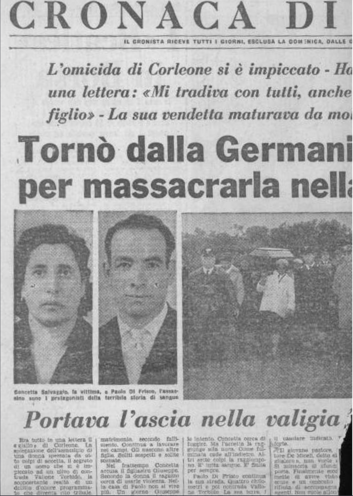

Era tutto in una lettera il «giallo» di Corleone. La spiegazione dell’assassinio di una donna spezzata da otto colpi di accetta, il segreto di un uomo che si è impiccato ad un ulivo di contrada Vallone Torbido, la sconcertante realtà di un delitto d’onore programmato che diventa rito tribale. sacrificio di sangue alla terra dei padri.

«Io sottoscritto Paolo Di Frisco uccido mia moglie Concetta Salvaggio e mi tolgo la vita perché ha calpestato il mio onore. Mi ha sempre tradito. Con tutti, prima del matrimonio e dopo. anche con mio figlio è stata. Li ho scoperti una sera abbracciati In Germania si è venduta per due etti di formaggio. È stata infedele come la mia prima moglie Anche lei mi tradiva. Tutti mi hanno tradito..».
Dietro questa «confessione in morte» c’è l’acquisto In Germania di una accetta. la decisione Improvvisa di un ritorno In Sicilia, le grida di una donna che inconsciamente avverte come un destino di sangue l’attende tra i mandorli e le trazzere del suo paese.

Perchè l’uxoricida suicida di Corleone non doveva solamente far pagare alla sua donna il prezzo delle sue tante, troppe colpe, ma voleva che U teatro della sua vendetta fosse quel fazzoletto di terra, quel pezzo della sua carne, che possedeva laggiù a Vallone Torbido. Quella terra che la fabbrica tedesca. il progresso cromato e translucido del paese che lo aveva ospitato offrendogli Il benessere, non erano riusciti a fargli dimenticare. E In questo agghiacciante viaggio attraverso l’Europa, con una ascia nella valigia e una moglie accanto terrorizzata verso una morte dal due volti che attende tra gli ulivi, si delinea la fisionomia di un delitto incredibile nella sua matrice psicologica quanto allucinante nella sua selvaggia dinamica.

Ma andiamo con ordine mettiamo innanzi tutto a fuoco i due personaggi di questa storia piena di sesso e di violenza liberiamoli da una folla di figli e parenti che sfuggono ad ogni classificazione. dalle comparse di questa tragica ballala della depressione morale, dove interesse, istinto, sottocultura fanno da sfondo alla «scelta» assurda e retriva, alla vendetta dell’uomo che tutti avevano sempre tradito.

### Personaggi incredibili

Paolo Di Prisco. Quarant’anni. Ha cinque figli. Giuseppe (31 anni) e Franca (18 suini) avuti dalla prima moglie Carmela Romano: Concetta Maria (14 anni). Rosetta (8 anni) e Giacomino (8 anni) nate dal suo secondo matrimonio con Concetta Salvagglo.

Si è sposato in prime nozze giovanissimo. La sua vita coniugale è un inferno. Accusa la moglie di essergli infedele. Le liti non si contano Spesso sono botte. Una aera dopo avere preso a calci la moglie le procura un aborto, convinto che il figlio che Carmela attende è frutto di una relazione adulterina Viene denunciato e finisce in carcere.

Siamo nel gennaio del 1949. Due mesi dopo la moglie muore. Alcuni sostengono per avvelenamento, altri attribuiscono a Paolo la responsabilità di questa fine. I giudici lo assolvono per insufficienza di prove: la sua detenzione
è durata sei mesi.

Torna libero e dopo poco tempo si sposa con Concetta Salvaggio, una
ragazza di Bisacquino che ha molte sorelle e pochi soldi. Secondo matrimonio, secondo fallimento. Continua a lavorare nei campi. Gli nascono altre figlie. Soliti sospetti e solite scenate.

Nel frattempo Concetta accusa il figliastro Giuseppe. Secondo la donna il ragazzo cerca di usarle violenza. Nella casa di Paolo non si vive più. Un giorno Giuseppe scompare. Dopo qualche mese annuncerà di essersi stabilito a Milano. Ha trovato un lavoro. Per lui è una nuova vita.

Ma le liti continuano. Di Frisco rompe i rapporti con un suo fratello che ha sposato una sorella della moglie, Antonina Salvaggio. Poi la grande decisione. Parte con la moglie per la Germania. Le quattro figlie vengono sistemate all’Istituto del SS. Salvatore a Corleone.

In Germania trova lavoro in una fabbrica. Guadagna bene. Con i soldi che riesce a risparmiare intesta due libretti (Banco di Sicilia) alla figlia Franca (50.000 e 27 mila), uno a testa sempre di 50.000 lire a Concetta. Rosetta e Giacomina. uno alla moglie per 600.000 lire ed uno al figlio Giuseppe. Su quest’ultimo un solo versamento che risale al 5 agosto 1961: tremila lire.

Ha pensato anche a se stesso. Presso il Banco di Sicilia ha versato a suo nome più di un milione. In contanti ha più di 715.000 lire che saranno ritrovate nella casetta di Cortile Firmaturi qualche ora dopo il delitto.

### Un piccolo fondo

Possiede inoltre un piccolo fondo, due ettari, a contrada Vallone Torbido. Ha già detto agli amici che intende lasciarlo alla figlia Franca. Ma il benessere che sta nascendo non riesce a dargli la tranquillità. si sente tradito. In Germania è sicuro che la moglie se la intende con un suo cugino e con un cognato di Bisacquino. Anzi è convinto che la moglie sia rimasta incinta di uno dei suoi amanti.

Decide di portarla In Sicilia. Quando la donna rifiuta non ha più dubbi. Nella sua mente prende corpo il delitto.

Compra una accetta i biglietti per tornare nella sua isola. A Corleone non va nemmeno a salutare il fratello che abita nella casa accanto alla sua. Con la moglie va a trovare le figlie Alla Superiora del SS. Salvatore l’unica persona con la quale al è sempre confidato. Rivela il suo dramma. La moglie lo tradisce, lo ha sempre tradito. Ma del suo «piano». del delitto, non parla.

La suora consiglia la calma. È abituata a questi sfoghi. Lo invita per qualche giorno a restare con le figlie nell’Istituto. L’uomo rifiuta. La scusa è che deve recarsi a Bisacquino dal parenti della moglie. Lascia l’Istituto alle 15.30 del giorno 18. Torna a casa. Con lui è sempre Concetta. Per la strada incontrano Francesco Rimasti (46 anni), zio di Paolo. Sara lui più tardi a riconoscere il cadavere sfigurato di Concetta Salvaggio. Rimasti è l’ultima persona a vedere vivi i due di contrada Vallone Torbido. La sera non escono.

### In campagna all'alba

All’alba Paolo Di Frisco costringe la moglie a seguirlo in campagna. Prendono la trazzera, tutto fango e massi, che conduce a «Signoruzzo». All’altezza del casolare dei Ciaravello l’uomo deva rivelare il suo folle intento. Concetta cerca di fuggire. Ma l’accetta la raggiunge alla nuca. Come fulminata cade all’indietro. Altri sette colpi la raggiungono. È tutta sangue. È finita per sempre.
Paolo Di Frisco continua la sua strada. Quattro chilometri e poi contrada Vallone Torbido La sua terra, i suoi olivi. È quasi arrivato. A pochi metri c’è il suo podere. Getta l’ascia, un sacchetto di yuta e l’ombrello. Abbandona la trovavo trazzera. I suoi piedi affondano nella terra. Più in alto su un colle un albero che conosce. È un olivo antico. Si siede. Prepara con cura quattro nodi scorsoi. La corda è nuova. L’hanno comprata il giorno prima. Ferma un estremo della corda ad un ramo alto. Si sistema il cappio intorno al collo. È sereno, finalmente sereno. C’è nell’aria intorno, l’odore forte del cactus e della terra piena di pioggia. Si lascia scivolare.

### Una donna insofferente

Concetta Salvaggio è una donna che arriva al matrimonio come ad un passaggio obbligato. Forse da ragazza ha già conosciuto altri uomini. Mette al mondo tre figlie. Da quel momento il suo problema è cercare di assicurare loro un avvenire economico tranquillo: una vita diversa Per questo lotta contro i figli che Paolo Di Frisco ha avuto dalla prima moglie. Se il marito è tormentato dalla gelosia lei pensa solo ai soldi.

In Germania la conquistata agiatezza la inebria. Nel corso di brevi visite a Corleone avverte l’insofferenza per quel paesaggio di squallore e di miseria che è il volto stesso della sua terra in lei è già in atto ti divorzio dalla campagna Il ritmo dell’industria l’ha conquistata.

Probabilmente detesta il marito legato ancora e, forse più disperatamente. all’isola lontana. Forse lo tradisce.

Quando Paolo le comunica la improvvisa decisione di tornare in’ Sicilia rifiuta Non vuole, ha paura Perchè? Non sa spiegarselo. Costretta alla fine sale sul treno. È un viaggio pieno di paurosi presentimenti.

### L'ascia nella valigia

L’alba del giorno 19 la sorprende in lacrime. Il marito vuole portarla a Vallone Torbido E terrorizzata Ha visto un’ascia nella valigia. Cerca di opporsi ma ancora una volta cede. All’altezza di «Signoruzzo». quando scorge il casolare di Ciaravello. tenta una fuga disperata. Ma l’acciaio le brucia la nuca. Poi tutto è buio.

Questi i personaggi, la loro brutale esistenza, la loro tragica fine. Vediamo ora. dall’«esterno» l’iter della risoluzione di questo «caso» che è balzato alla ribalta della cronaca con la scoperta del cadavere di Concetta Salvaggio la mattina del 19. In contrada «Signoruzzo».

Venerdì ore 22: polizia e carabinieri non sono ancora riesciti a dare un volto alla donna assassinata. La gente non parla. Nessuno l’ha mai vista.

Ore 23.30: arriva al Commissariato una segnalazione. Un ragazzo avrebbe visto un’arma sospetta nel pressi di contrada Vallone Torbido. Parte una squadra. La comanda il brigadiere Accordino. uno dì quelli che sanno tutto sulla «mala» del Corleonese. Riescono a trovare il giovane pastore Salvatore de Miceli non vuole aprire. Si minaccia di sfondare la porta. Finalmente esce e ammette di aver visto una scura ed un ombrello. Si rifiuta di accompagnare gli agenti. Non vuole allontanarsi da Muranna: ha paura che gli rubino le pecore. Alcuni agenti sono disposti a fare la guardia al gregge. Dopo un'ora l'arma del delitto è sul tavolo del commissario Pirro e del capitano dei carabinieri Carlino. Alle 9.30 una pattuglia scopre un uomo impiccato ad un ulivo in contrada Vallone Torbido. In tasca ha un passaporto (n. 334285): si chiama Paolo Di Frisco. E' nato il 2 giugno del 1925. E' sposato. Quando la notizia arriva al commissariato sono le dieci.

Da quel momento le indagini assumono un ritmo vertiginoso. Si ricercano i parenti delle due vittime. I tre fratelli del suicida (Leoluca, Salvatore e Bernardo) riconoscono immediatamente dalla foto il loro congiunto.

Ore 12: finalmente il cadavere della donna viene riconosciuto È lo zio di Paolo Di Frisco. Francesco Rimasti. l’ultimo ad averli visti vivi poche ore prima, che permette di stabilire ufficialmente anche l’identità della seconda vittima.

### Ritmo vertiginoso

Ore 18: sopralluogo a contrada Vallone Torbido. C’è il sostituto procuratore della repubblica Michele Agrifoglio. Il professore Ideale Del Carpio direttore dell’Istituto di medicina legale. il medico legale dottore Verde, il colonnello Mellito del Gruppo Esterno il dottore Pirrò e il capitano Carlino. Si prende posto sulle «campagnole». Un carro trainato da un mulo porta una bara. dalla trazzera il corpo di Paolo Di Frisco. su a monte, appare sospeso in aria La testa
è piegata a destra, come spezzata. Appoggiato ad un albero un fratello del morto piange. L’altro seduto al piedi dell’impiccato carezza le ginocchia del morto e continua a chiamarlo. Si procede nelle operazioni di rito. Si perquisisce alla presenza del Procuratore il cadavere. In un borsellino la lettera che spiega i motivi dell’omicidio - suicidio e una foto di Elizabeth Taylor Si cala il corpo nella bara. Si stringono le viti.

Ore 17: le «campagnole» risalgono la trazzera. All’entrata del paese una panoramica di volti impenetrabili. È la gente che non «sa» mai nulla che però sa tutto. Si arriva al cimitero. Nella camera mortuaria c’è il cadavere di Concetta. Le hanno coperto il ventre con un foglio di giornale- i capelli sono un grumo di sangue il professore Del Carpio esamina Il corpo Non c’è bisogno di autopsia.

La donna è stata uccisa da otto colpi di accetta. Uno l’ha raggiunta alla nuca, gli altri in fronte e sulle tempie. Un infermiere con un enorme grembiule di gomma estrae liquido vaginale un esame necessario per determinare se la donna fosse realmente incinta Fuori c’è un fratello di Concetta. Soffre perchè tutti quegli uomini guardano, toccano il corpo nudo della donna Il brigadiere Accordino ha posato II mitra tn un angolo II «caso» è risolto. Si potrà dormire su una lapide accanto alla camera mortuaria si legge: «Acciò veda ciascun come la morte tutto il bello dell’uomo guasta e scompone».