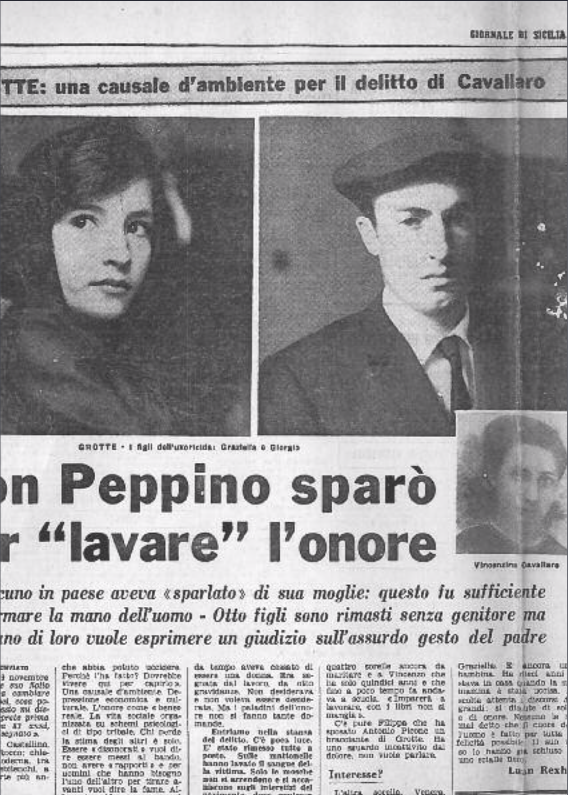

## Grotte, 19 novembre

«Domineddio e suo figlio non riuscirono a cambiare la testa dei farisei, cosa potevo fare io? Questo mi disse il vecchio arciprete prima di morire. Aveva 83 anni, era stanco e rassegnato».
Parla Padre Castellino, parroco di San Rocco: chiesa arancione, moderna, tra litanie di tetti sbilenchi, a monte, nella parte più antica del paese.

### Il delitto

Siamo a Grotte, a pochi chilometri da Agrigento, nel retroterra dei grandi feudi e delle miniere dove non c’è più lavoro.

La strada che corre tra terre argillose verso il paese segna una linea di confine tra un sospetto di progresso e un mondo regolato, ieri come oggi da tabù retrivi e anacronistici.

Veniamo da Palermo e ci chiamano «forestieri». La mancanza di ricambio ha generato diffidenza per quel li di fuori». Gli uomini sono tutti in piazza. Le donne non si vedono. «Stanno in casa». I tre colpi di rivoltella esplosi da Peppino Cavallaro alla moglie hanno ricordato a tutte che con l’«onore» non si scherza.

Fu di lunedì. Alle 9,30 Cavallaro rientrò in casa. Trovò sua moglie nella stanza da letto. Senza parlare puntò su di lei la «42» e fece fuoco tre volte. L’am- mazzò sul colpo. Chiuse la porta e usci. Si avviò verso il centro del paese. Dopo cento metri incontrò Giacomo Cipolla, un maestro di vent’anni. Anche sul ra- gazzo sparò tre volte: ma questa volta non furono colpi mortali.

Sono passati undici giorni, ne parlano ancora. A bassa voce s’intende e tra «amici». Con noi nessuno vuole scambiare una parola. Non sanno niente.

Per trovare la casa di Cavallaro ci rivolgiamo a Padre Castellino. Le sorelle dell’assassino sono sue parrocchiane. Conosce bene anche Giuseppe Cavallaro: «È stato sempre un brav’uomo. Ha lavorato tutta la vita e adesso stavano bene.
Non riesco ancora a credere che abbia potuto uccidere. Perchè l’ha fatto? Dovrebbe vivere qui per capirlo». Una causale d’ambiente. Depressione economica e culturale. L’onore come «bene» reale. La vita sociale organizzata su schemi psicologici di tipo tribale. Chi perde la stima degli altri è solo. Essere «disonorati» vuol dire essere messi al bando, non avere «rapporti» e per uomini che hanno bisogno l’uno dell’altro per tirare avanti vuol dire la fame. Allora si uccide per tornare ad aver stretta la mano, per sposare le proprie figlie, per aver credito allo spaccio. A Grotte, come in altri cento paesi della «profonda Sicilia».

### Una madre

A casa Cavallaro ci accompagna un cugino di Antonia Piazza, la donna che è andata a scontare su un tavolo dell’obitorio un peccato non commesso. Aveva 46 anni: era una madre e da tempo aveva cessato di essere una donna. Era segnata dal lavoro, da otto gravidanze. Non desiderava e non voleva essere desiderata. Ma i paladini dell’onore non si fanno tante domande.

Entriamo nella stanza del delitto. C’è poca luce. È stato rimesso tutto a posto. Sulle mattonelle hanno lavato il sangue della vittima. Solo le mosche non si arrendono e si accaniscono sugli interstizi del pavimento dove qualcosa deve essere rimasto. Ci sono immagini benedette e fotografie di parenti appese alle pareti. I mobili sono moderni e lucidi, un tentativo di benessere. Non c’è niente da scoprire.

Nell’altra stanza ci sono i figli e i parenti. Hanno sbarrato le finestre. Resteranno chiuse per mesi: così vuole il rito del lutto. Tutti vestono di nero. Giorgio, il maggiore dei maschi, porta la coppola. Ora è il capo famiglia. Dovrà pensare alle quattro sorelle ancora da maritare e a Vincenzo che ha solo quindici anni e che fino a poco tempo fa andava a scuola. «Imparerà a lavorare, con i libri non si mangia».

C’è pure Filippa che ha sposato Antonio Picone un bracciante di Grotte. Ha uno sguardo incattivito dal dolore, non vuole parlare.

### Interesse?

L’altra sorella, Venera, sta in Inghilterra. È la moglie del fratello di Gioacchino Cipolla, il ragazzo che i proiettili della «42» di Cavallaro hanno costretto in un letto dell’ospedale di Agrigento.

Sono seduti in circolo. Confermano quanto hanno già detto ai carabinieri. Il delitto è senza spiegazione. Cipolla era un parente. Avrà parlato con Vincenzina ma questo non vuol dire che la corteggiasse. Con Antonia Piazza poi non si vedevano mai. Ma Giuseppe Cavallaro ha sparato. Qualcuno avrà «sparlato» le donne della sua famiglia e il sospetto non poteva che cadere su quel ragazzo istruito che andava spesso ad Agrigento. Qualche discussione d’interesse c’era stata con la famiglia Cipolla, per via di soldi che avrebbe dovuto avere la figlia Venera come dote il giorno che andò all’altare con Salvatore.

Era una questione rimasta in sospeso e che ogni tanto tornava ad essere «ragionata». Forse proprio in una di queste discussioni Antonio Piazza si schierò dalla parte dei consuoceri confermando in Giuseppe Cavallaro il sospetto che quelle «voci» erano attendibili e che il suo «onore» infangato doveva essere «la- vato».

Basta molto di meno per uccidere quando si crede al codice del’onore.

### Una bambina

Ma di questo i figli di Cavallaro non vogliono parlare più. Non sono loro che debbono giudicare il padre. Possono piangere la donna che hanno seppellito e che li aveva messi al mondo ma giudicare no. Sarebbe infrangere un’altra delle loro «leggi». Ora stanno seduti in circolo e aspettano che Giorgio decida cosa si debba fare. Bisognerà tirare avanti. Sul maschio graveranno e responsabilità economiche della famiglia ma anche quelle morali molto più pesanti. Dopo quello che è successo tutti gli occhi del paese saranno sulle donne ella sua famiglia. Dovranno essere «femmine onorate» o saranno guai.

Per Giorgio Cavallaro e le e sorelle non saranno anni facili. Il delitto del padre a «cancellato» una colpa possibile e ha ridato loro una «onorabilità». Bisognerebbe fare di tutto per essere degni.

In un angolo è seduta Graziella. È ancora una bambina. Ha dieci anni e stava in casa quando la sua mamma è stata uccisa. Ascolta attenta li discorsi del grandi: si discute di soldi e di onore. Nessuno le ha mai detto che il cuore dell’uomo è fatto per tutta la felicità possibile. Il suo viso lo hanno già chiuso in uno scialle nero.